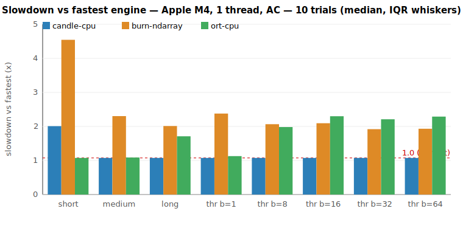
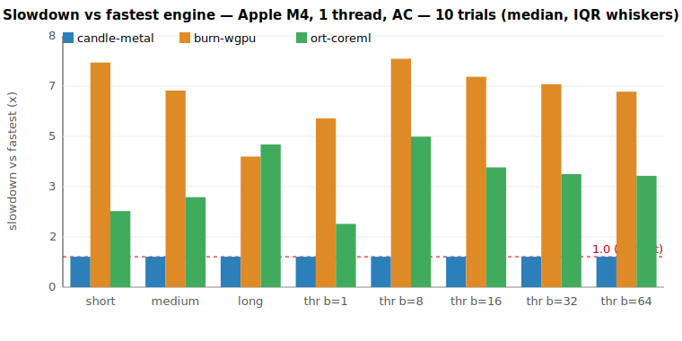

# Candle vs Burn vs ONNX Runtime — benchmark report

**Recommendation: use Candle for the NAHPU desktop embedding workload.**
Across CPU, GPU, and footprint, Candle is the best all-round engine. ONNX Runtime
(`ort`) is a strong, genuinely independent contender — it has the **lowest
single-embed latency on CPU** for short inputs — but loses to Candle on
throughput, cold start, binary size, and adds a C++ runtime dependency. Burn
trails both on raw speed; its merit is portability (mobile-GPU reach), not
desktop performance.

The three engines run the **same** all-MiniLM-L6-v2 model (Candle from
safetensors; Burn and ORT from the identical ONNX export), and produce
**identical embeddings** (parity below), so every speed number is apples-to-apples.

## Environment

- CPU: **Apple M4** (4 performance + 6 efficiency cores), `RAYON_NUM_THREADS=1`, **AC power**
- macOS arm64, all-MiniLM-L6-v2 (384-dim), f32, inference only
- Candle + Burn use **Apple Accelerate** BLAS; ORT uses ONNX Runtime's own
  optimized CPU kernels (graph-level fusion + its built-in GEMM)
- 10 interleaved trials; tables show **median [IQR]** across trials
- Parity gate (Phase 0): worst-pair min cosine similarity **1.000000**

## Parity (Phase 0)

| Pair | min cosine |
|---|---|
| candle-cpu vs burn-ndarray | 1.000000 |
| candle-cpu vs ort-cpu | 1.000000 |
| burn-ndarray vs ort-cpu | 1.000000 |

All three engines are numerically equivalent — speed is the only differentiator.

## Results (CPU)

Latency = interactive single embed (batch 1, p50). Throughput = bulk batch.
**Bold = fastest** in each row.

| Scenario | candle-cpu | burn-ndarray | ort-cpu | Fastest |
|---|---|---|---|---|
| Latency, short (~3 tok) | 3.47 ms [0.68] | 7.85 ms [1.08] | **1.85 ms** [0.12] | **ort** (1.9× vs candle) |
| Latency, medium (~10 tok) | **4.29 ms** [0.59] | 9.19 ms [0.98] | 4.34 ms [0.21] | candle ≈ ort (tie) |
| Latency, long (~50 tok) | **10.33 ms** [0.91] | 19.34 ms [3.23] | 16.44 ms [0.51] | **candle** (1.6× vs ort) |
| Throughput, batch 1 | **233/s** [41] | 105/s [21] | 222/s [22] | candle ≈ ort (tie) |
| Throughput, batch 8 | **541/s** [58] | 281/s [21] | 293/s [11] | **candle** (1.9× vs ort) |
| Throughput, batch 16 | **560/s** [51] | 287/s [21] | 262/s [16] | **candle** (2.1× vs ort) |
| Throughput, batch 32 | **536/s** [46] | 300/s [25] | 260/s [18] | **candle** (2.1× vs ort) |
| Throughput, batch 64 | **538/s** [77] | 299/s [23] | 252/s [15] | **candle** (2.1× vs ort) |

**Reading the CPU result:**
- **ORT wins the smallest, latency-critical case** — a single short embed is
  1.9× faster than Candle (1.85 vs 3.47 ms). ORT's graph-level optimization
  shines when per-call fixed overhead dominates.
- **Candle wins everything as the work grows** — medium/long latency and every
  batch size. ORT's per-call edge disappears once real matmul work dominates;
  at batch ≥8 Candle is ~1.9–2.1× ORT's throughput.
- **Burn is last on CPU** except large-batch throughput, where it slightly edges
  ORT (1.1–1.2×). Both lose decisively to Candle.

## Results (GPU)

Candle Metal vs Burn wgpu vs ORT CoreML. All timings include host read-back
(full device execution + sync). **Bold = fastest.**

| Scenario | candle-metal | burn-wgpu | ort-coreml | Fastest |
|---|---|---|---|---|
| Latency, short | **2.48 ms** [0.11] | 18.30 ms [0.52] | 6.20 ms [1.54] | **candle** (2.5× vs ort) |
| Latency, medium | **2.87 ms** [0.13] | 18.52 ms [0.20] | 8.48 ms [1.59] | **candle** (2.9× vs ort) |
| Latency, long | **4.49 ms** [0.05] | 19.25 ms [0.16] | 21.03 ms [4.53] | **candle** (4.7× vs ort) |
| Throughput, batch 8 | **1239/s** [72] | 165/s [2] | 251/s [13] | **candle** (4.9× vs ort) |
| Throughput, batch 32 | **1199/s** [40] | 180/s [11] | 323/s [11] | **candle** (3.7× vs ort) |
| Throughput, batch 64 | **1168/s** [10] | 182/s [11] | 319/s [7] | **candle** (3.7× vs ort) |

**Candle Metal dominates by 3.7–7.5×.** Among the two challengers, **ORT-CoreML
beats Burn wgpu on throughput** (~1.6–1.8×) and on short/medium latency, but it
loses to wgpu on long inputs and is highly variable (large IQR). CoreML also
**only ran once switched to the MLProgram format** — the default NeuralNetwork
format failed at runtime on this dynamic-shape BERT export (see caveats).

## Secondary metrics (footprint)

Median over 7 fresh-process runs (cold start, peak RSS); stripped release binary
(code only — model weights are external for all three); full-clean build time.

| Metric | candle-cpu | burn-ndarray | ort-cpu | Best |
|---|---|---|---|---|
| Cold start (load + first embed) | **30.0 ms** | 44.7 ms | 83.0 ms | candle |
| Peak RSS | **198.6 MB** | 245.4 MB | 234.4 MB | candle |
| Binary size (stripped) | **7.2 MB** | 10.3 MB | 21.2 MB | candle |
| Clean build time | 144.5 s | 146.8 s | **86.5 s** | ort |

- **Candle wins cold start, memory, and binary size.** ORT pays for its C++
  runtime: the slowest cold start (graph optimization on session init) and the
  largest binary (it bundles ONNX Runtime, ~21 MB).
- **ORT wins build time** — it doesn't compile a large Rust ML framework
  (download-binaries pulls a prebuilt ORT), so the workspace builds ~40% faster.

## How to read this (methodology)

An unpinned laptop drifts run-to-run by more than 5% (Apple Silicon P/E-core
scheduling + power management), so absolute single-run reproducibility is not
achievable here. We therefore **interleave** all engines within each trial (the
starting engine rotates per trial) so every engine sees identical conditions,
then report the **per-trial pairwise speedup ratio**. A pair is **distinguishable**
when the IQR of that ratio excludes 1.0 — i.e. the effect exceeds run-to-run
spread. "tie" in the tables means not distinguishable.

## Interpretation for NAHPU

- **Interactive semantic search** (one short query at a time): this is the one
  place **ORT is fastest** (1.85 ms vs Candle's 3.47 ms for a short input). If
  the product is dominated by tiny single queries, ORT is worth considering.
- **Bulk indexing** of the collection: **Candle** is ~1.9–2.1× faster than both
  others at every batch size, on both CPU and (far more so) GPU.
- **Overall**: Candle is the best general-purpose choice and the lightest to
  ship. ORT's win is narrow (short-input CPU latency) and comes with a heavier
  binary, slower cold start, and a C++ dependency.

## Caveats / revisit triggers

- **ORT short-latency edge is real but narrow.** It holds only for small inputs
  at batch 1; it inverts as soon as the batch or sequence grows. Re-measure with
  NAHPU's actual query-size distribution before weighting it heavily.
- **CoreML is finicky.** ORT's CoreML EP needed the MLProgram model format to run
  this BERT export at all, and still showed high variance and poor long-input
  latency. ORT-CoreML is not a turnkey desktop-GPU path.
- **Desktop only.** The Flutter (FFI) layer is framework-agnostic and does not
  change this ranking. Mobile is out of scope: there the trade-off is
  *availability* — Burn's wgpu reaches mobile GPUs and ORT has mobile builds,
  while Candle is CPU-only on iOS.
- **Threads:** `RAYON_NUM_THREADS=1` pins Candle/Burn's Rayon pool and ORT's
  intra-op threads to 1; Accelerate manages its own internal threads (symmetric
  for Candle/Burn). 
- Re-evaluate if **on-device training/fine-tuning** (Burn) or a **portable single
  runtime across server + mobile** (ORT) becomes a hard requirement.

Reproduce:
- Parity: `scripts/fetch-model.sh && cargo run -p runner --bin runner`
- CPU: `RAYON_NUM_THREADS=1 cargo run --release -p runner --bin bench cpu && python3 scripts/plot.py results/cpu-*.json results/plots`
- GPU: `cargo run --release -p runner --bin bench --features gpu -- gpu && python3 scripts/plot.py results/gpu-*.json results/plots/gpu`
- Footprint: `RAYON_NUM_THREADS=1 scripts/secondary.sh`
