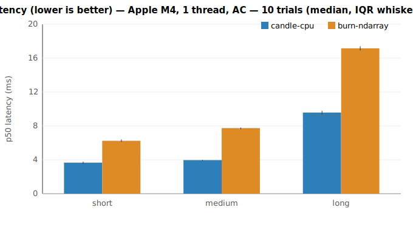
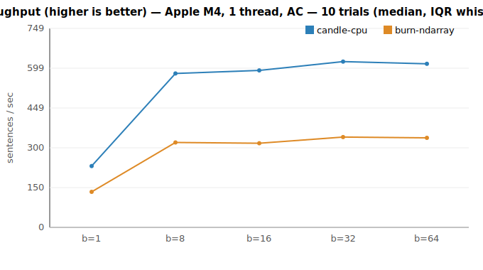
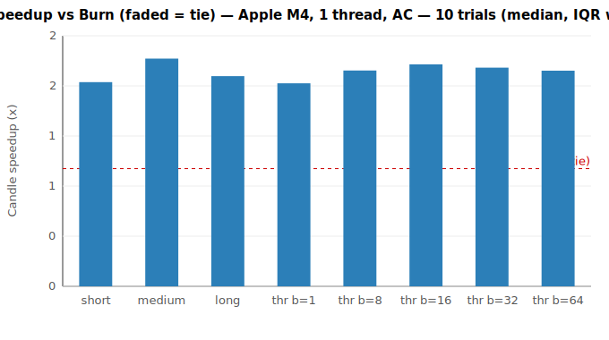
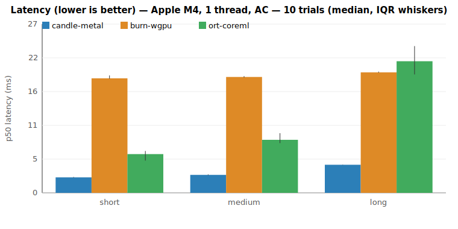
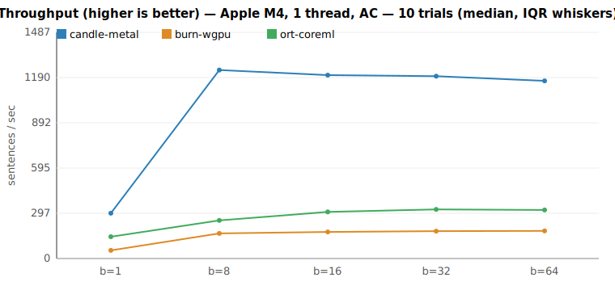

# Candle vs Burn — benchmark report (Phase 1)

**Recommendation: use Candle for the NAHPU desktop embedding workload.**
With both engines on their best CPU config (Apple Accelerate BLAS), Candle is
~1.8× faster for interactive search (latency) and bulk indexing (throughput), and
lighter on every footprint metric (cold start, memory, binary size). On GPU
(Metal vs wgpu) Candle leads by 4–7.8×. Revisit if scope changes (see caveats).

## Environment

- CPU: **Apple M4** (4 performance + 6 efficiency cores), `RAYON_NUM_THREADS=1`, **AC power**
- macOS arm64, all-MiniLM-L6-v2 (384-dim), f32, inference only
- **Both engines use Apple Accelerate BLAS** (Candle `accelerate` feature, Burn
  `accelerate` feature) — the matched, best-config CPU comparison (see the BLAS
  note below for why this matters)
- 10 interleaved trials; tables show **median [IQR]** across trials
- Parity gate (Phase 0): min cosine similarity **1.000000** — engines are equivalent

## Results (CPU, both on Accelerate)

| Scenario | Candle | Burn | Candle speedup | Verdict |
|---|---|---|---|---|
| Latency, short (~3 tok) | **3.68 ms** [0.26] | 6.28 ms [0.29] | 1.74× | Candle |
| Latency, medium (~10 tok) | **3.98 ms** [0.11] | 7.78 ms [0.21] | 1.94× | Candle |
| Latency, long (~50 tok) | **9.63 ms** [0.41] | 17.26 ms [0.49] | 1.79× | Candle |
| Throughput, batch 1 | **231/s** [15] | 134/s [15] | 1.73× | Candle |
| Throughput, batch 8 | **579/s** [25] | 320/s [17] | 1.83× | Candle |
| Throughput, batch 16 | **591/s** [30] | 317/s [14] | 1.89× | Candle |
| Throughput, batch 32 | **624/s** [24] | 340/s [19] | 1.86× | Candle |
| Throughput, batch 64 | **616/s** [7] | 337/s [38] | 1.83× | Candle |

### BLAS configuration matters (fairness check)

The CPU result is highly sensitive to the matmul backend. We measured three configs:

| Config | Result |
|---|---|
| Neither uses BLAS (default ndarray + default candle) | Candle ~1.3× (long: near tie) |
| **Burn on Accelerate, Candle not** | **Burn wins** (1.1–1.8×) — unfair to Candle |
| **Both on Accelerate** (reported above) | **Candle ~1.8×** |

Both frameworks speed up a lot with Accelerate (Candle's long latency 26.8 → 9.6 ms;
Burn's 25.7 → 17.3 ms), but Candle gains more. The honest conclusion requires
matching the BLAS backend; with that done, Candle's lead is *larger*, not smaller.

## Secondary metrics (footprint)

Median over 7 fresh-process runs (cold start, peak RSS); stripped release binary
(code only — model weights are external for both engines); full-clean build time.

| Metric | Candle | Burn | Winner |
|---|---|---|---|
| Cold start (load + first embed) | **23.5 ms** | 36.8 ms | Candle |
| Peak RSS | **194 MB** | 236 MB | Candle |
| Binary size (stripped) | **7.3 MB** | 9.4 MB | Candle |
| Clean build time | 85.1 s | 84.7 s | ~tie |

Candle starts faster, uses ~18% less memory, and ships a smaller binary — all
favorable for a desktop app. Build time is a wash (dominated by shared deps).

## Phase 2 — GPU (Candle Metal vs Burn wgpu)

Same harness, GPU backends (Apple M4 GPU). Both measure with host read-back, so
timings include full GPU execution + sync.

| Scenario | Candle Metal | Burn wgpu | Candle speedup |
|---|---|---|---|
| Latency, short | **2.17 ms** [0.01] | 16.41 ms [0.27] | 7.55× |
| Latency, medium | **2.52 ms** [0.02] | 16.27 ms [0.60] | 6.50× |
| Latency, long | **4.11 ms** [0.09] | 17.18 ms [0.36] | 4.19× |
| Throughput, batch 8 | **1391/s** [188] | 179/s [4] | 7.77× |
| Throughput, batch 32 | **1373/s** [63] | 214/s [12] | 6.43× |
| Throughput, batch 64 | **1345/s** [62] | 218/s [5] | 6.19× |

**Candle Metal dominates by 4–7.8×.** Its throughput (~1390/s) is ~2.2× its own
Accelerate CPU result (624/s) — a further win for desktop bulk indexing. Burn wgpu is surprisingly slow
(even slower than Burn on CPU for latency): wgpu's per-dispatch overhead dominates
for a small model like MiniLM. Burn's wgpu value is **portability** (it *reaches*
iOS/Android/Vulkan GPUs), not raw desktop-Metal speed.

## How to read this (methodology)

An unpinned laptop drifts run-to-run by more than 5% (Apple Silicon P/E-core
scheduling + power management), so absolute single-run reproducibility is not
achievable here. We therefore **interleave** the two engines within each trial
(order alternates) so both see identical conditions, then report the **per-trial
speedup ratio**. A scenario is called **distinguishable** when the IQR of that
ratio excludes 1.0 — i.e. the effect size exceeds the run-to-run spread. All
scenarios above are distinguishable.

## Interpretation for NAHPU

- **Interactive semantic search** (the latency-critical path) → Candle is
  ~1.7–1.9× faster across short/medium/long inputs. This is the UX-facing win.
- **Bulk indexing** of the existing collection → Candle ~1.8× higher throughput
  across all batch sizes.
- The win is consistent across every input length (no Burn-favored regime on CPU
  once both use Accelerate).

## Caveats / revisit triggers

- **Desktop only.** The Flutter (FFI) layer is a framework-agnostic constant and
  does not change this ranking. On desktop GPU (Metal), Candle widens its lead
  (Phase 2). Mobile is out of scope: there the trade-off is *availability* — Candle
  is CPU-only on iOS, while Burn's wgpu *reaches* mobile GPUs (though, per Phase 2,
  wgpu is not fast on desktop — its merit is portability, not raw speed).
- **Threads:** `RAYON_NUM_THREADS=1` pins each framework's Rayon pool; Accelerate
  manages its own internal threads, but since *both* engines use Accelerate this
  is symmetric. Phase 2 adds GPU.
- Re-evaluate Burn if **on-device training/fine-tuning** or **iOS/Android GPU
  reach** become hard requirements.

Reproduce:
- CPU: `scripts/fetch-model.sh && RAYON_NUM_THREADS=1 cargo run --release -p runner --bin bench cpu && python3 scripts/plot.py`
- GPU: `cargo run --release -p runner --bin bench --features gpu -- gpu && python3 scripts/plot.py results/gpu-*.json results/plots/gpu`
